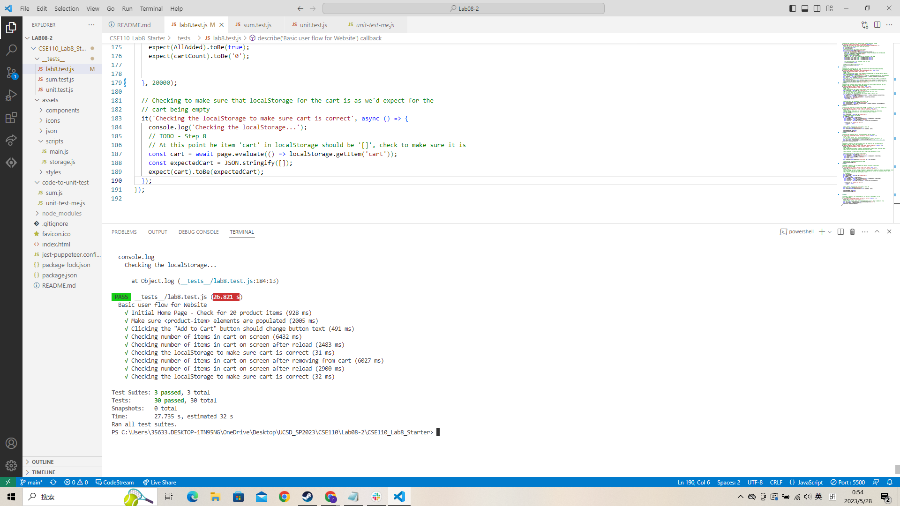

# Lab 8 - Starter

Name: Rui Li

Questions

1. Within a Github action that runs whenever code is pushed. 
   
   Reason: Choosing to have the automated tests run when I push allows me to immediately know if there are possible bugs in the code I am modifying and can fix them. Compared with the other two options: If I choose manual testing, it will spend too much time on repetitive work, and I may miss some test cases. And if I test after all the development is done, my code is likely to be coupled with many other functions, making it a risky and difficult thing to modify the program.

2. No. 
   
   Reason: E2E test simulates the flow of the user in the entire program. It is too inefficient to use it to test the return value of a function. I prefer to use unit test.

3. No.
   
   Reason: Because unit test is hard to test hiw individual components interact with each other. Since the “message” feature allows a user to write and send a message to another user, it may affects a lot of components, and it is hard to determine what are we excepted. 

4. Yes.

   Reason: Because "max message length" is a very specific requirement, we can know exactly what the expected result is, and testing this one condition does not require interaction with many other elements.